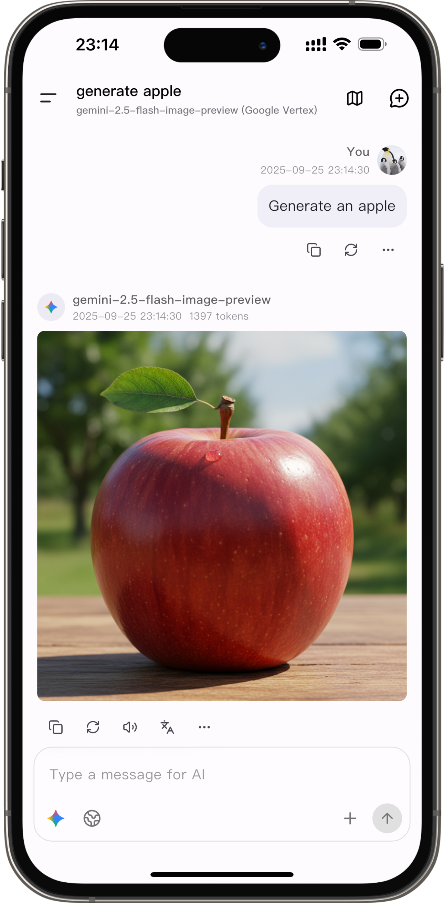
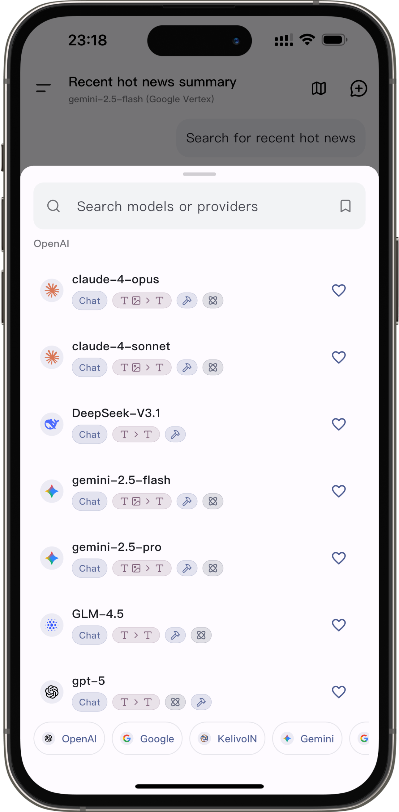
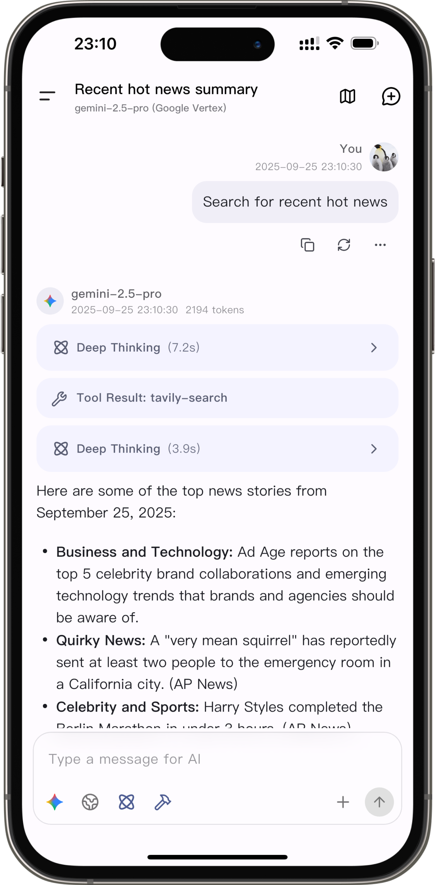
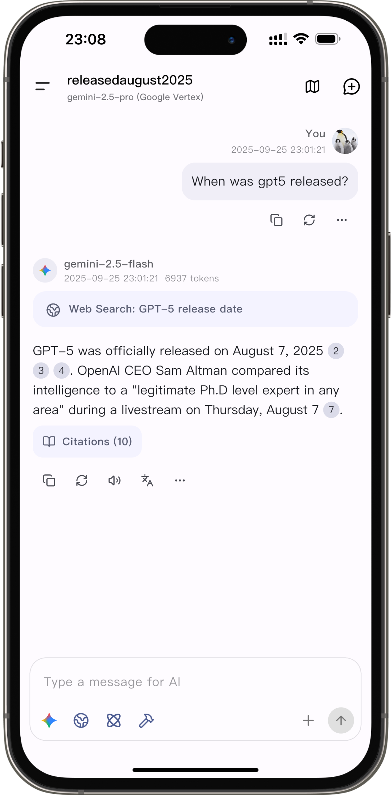

  
  <h1>Kelivo</h1>

A Flutter LLM chat client

  
  

English | [简体中文](README_ZH_CN.md)

  
  
  
  

## 🚀 Download

🔗 [Download Latest Release](https://github.com/Chevey339/kelivo/releases/latest)

🔗 [TestFlight](https://testflight.apple.com/join/erbGGykR) Join the beta testing.

## 💖 Sponsors

Thanks to [siliconflow.cn](https://siliconflow.cn) for partnering with us to provide free-to-use models.

## ✨ Features

- 🎨 **Modern Design** - Material You design language with dynamic theme colors (Android 12+)
- 🌙 **Dark Mode** - Perfect dark theme support to protect your eyes
- 🌍 **Multi-language** - Supports Chinese and English UI
- 🖥️ **Cross-platform** - Mobile & Desktop (Android/iOS/Harmony, Windows/macOS/Linux)
- 🔄 **Multi-provider** - Supports OpenAI, Google Gemini, Anthropic and other major AI providers
- 🤖 **Custom Assistants** - Create and manage personalized AI assistants
- 🖼️ **Multi-modal Input** - Supports images, text files, PDF, Word documents and more
- 📝 **Markdown Rendering** - Full support for code highlighting, LaTeX formulas, tables, etc.
- 🎙️ **Voice Services** - Built-in system TTS, plus OpenAI / Google Gemini / ElevenLabs voice servers
- 🛠️ **MCP Support** - Model Context Protocol tool integration
- 🧰 **Built-in MCP Tools** - Built-in fetch MCP tool
- 🔍 **Web Search** - Integrates multiple search engines (Bing, DuckDuckGo, Exa, Tavily, Zhipu, LinkUp, Brave, Metaso, SearXNG, Ollama, Jina, Perplexity, Bocha, Serper, Grok)
- 🧩 **Prompt Variables** - Supports dynamic variables like model name, time, etc.
- 📤 **QR Code Sharing** - Export and import provider configurations via QR codes
- 💾 **Data Backup** - Chat history backup and restore support
- 🌐 **Custom Requests** - Supports custom HTTP headers and request bodies
- 🔡 **Custom Fonts** - Supports custom fonts (system fonts / Google Fonts)
- ⚙️ **Android Background Chat** - Continue generating messages in the background (enable in settings)

## 📱 Platform Support

- ✅ Android
- ✅ iOS
- ✅ Harmony ([kelivo-ohos](https://github.com/Chevey339/kelivo-ohos))
- ✅ Windows
- ✅ macOS
- ✅ Linux

## 🤝 Contributing

Pull Requests and Issues are welcome!

1. Fork the repository
2. Create your feature branch (`git checkout -b feature/AmazingFeature`)
3. Commit your changes (`git commit -m 'Add some AmazingFeature'`)
4. Push to the branch (`git push origin feature/AmazingFeature`)
5. Open a Pull Request

## ❤️ Acknowledgements

Special thanks to the [RikkaHub](https://github.com/re-ovo/rikkahub) project for UI design inspiration. Kelivo's interface design is heavily inspired by RikkaHub's beautiful and practical design.

## ⭐ Star History

If you like this project, please give it a Star ⭐

## 📄 License

This project is licensed under the AGPL-3.0 License - see the [LICENSE](LICENSE) file for details.

## 📞 Contact

- Issue: [GitHub Issues](https://github.com/Chevey339/kelivo/issues)

---

Made with ❤️ using Flutter

